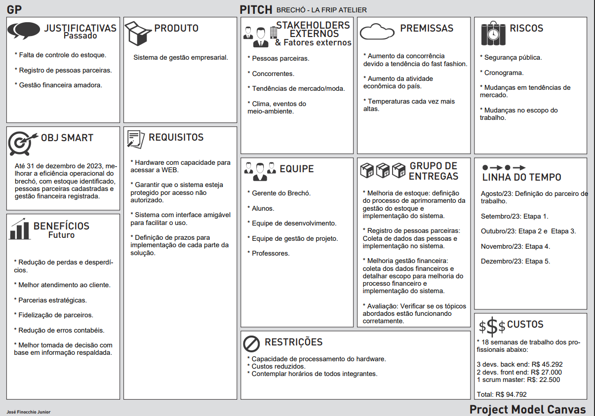
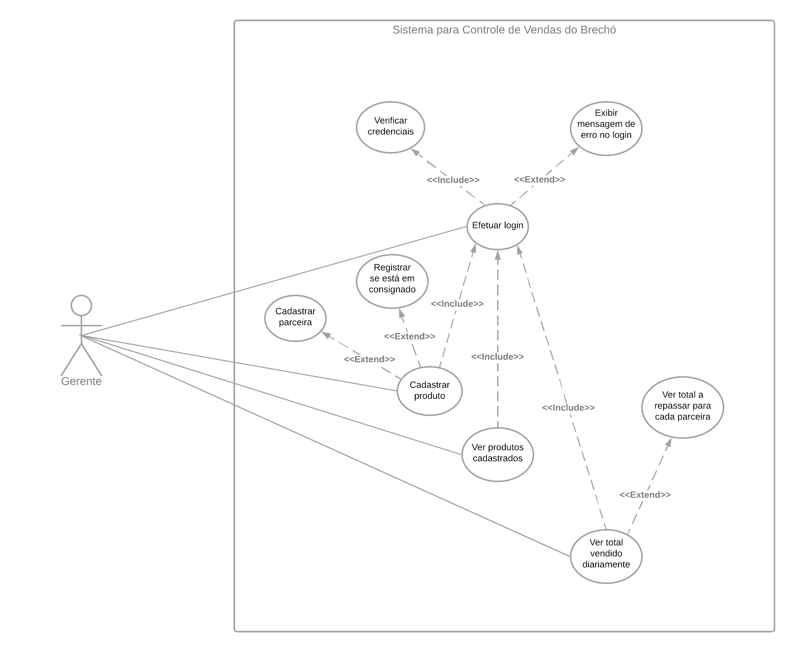
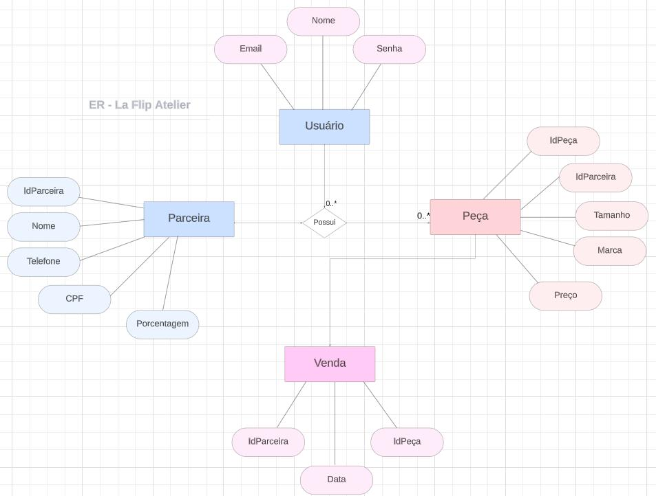

# Especificações do Projeto

As especificações do projeto foram elaboradas por meio de discussões entre os membros da equipe. Os pontos mais relevantes identificados durante essas discussões foram consolidados, fornecendo uma definição precisa do problema a ser abordado. Essas especificações serão a base para o desenvolvimento do projeto.

## Arquitetura e Tecnologias

o	Descreva brevemente a arquitetura definida para o projeto e as tecnologias a serem utilizadas. Sugere-se a criação de um diagrama de componentes da solução.

## Project Model Canvas

Modelo consolidado para apresentação da proposta da solução.

## Requisitos

As tabelas que se seguem apresentam os requisitos funcionais e não funcionais que detalham o escopo do projeto. Para determinar a prioridade de requisitos, foi aplicado a técnica de priorização de requisitos por níveis: BAIXA, MÉDIA e ALTA.

### Requisitos Funcionais

|ID    | Descrição do Requisito  | Prioridade |
|------|-----------------------------------------|----|
|RF-001| Disponibilizar um sistema de login e autenticação administrador, onde o usuário poderá criar uma conta com dados válidos e realizar login. | ALTA | 
|RF-002| Disponibilizar ao usuário uma plataforma de cadastro de clientes parceiras   | ALTA |
|RF-003| Disponibilizar ao usuário uma plataforma de cadastro de produtos consignados   | ALTA |
|RF-004| Disponibilizar ao usuário uma plataforma de consulta para produtos consignados cadastrados atrelados a uma cliente parceira | ALTA |
|RF-005| Disponibilizar ao usuário uma plataforma de consulta de vendas diárias e valores | ALTA |
|RF-006| Permitir que o o usuário verifique a porcentagem do valor que deve ser repassado para a cliente parceira | ALTA |

### Requisitos não Funcionais

|ID     | Descrição do Requisito  |Prioridade |
|-------|-------------------------|----|
|RNF-001| O sistema deve possuir compatibilidade com os principais navegadores do mercado | ALTA |
|RNF-002| A aplicação deve ser intuitiva, de fácil utilização e entendimento, descartando a necessidade de treinamentos |  MÉDIA | 
|RNF-003| A aplicação deve ter uma interface limpa e direcionada ao usuário, visando otimizar a performance e o processamento ágil das requisições | MÉDIA |

## Restrições

O projeto está restrito pelos itens apresentados na tabela a seguir.

|ID| Restrição                                             |
|--|-------------------------------------------------------|
|01| O projeto deverá ser entregue até o final do semestre, em 06 de dezembro de 2023 |
|02| Não poderá ocorrer contratação de terceiros para o desenvolvimento      |
|03| Não é permitido a remuneração financeira para a equipe durante a execução deste trabalho acadêmico |

## Diagrama de Casos de Uso

O diagrama apresentado abaixo descreve de forma clara e visual as interações essenciais entre atores e casos de uso, no contexto dos Requisitos Funcionais do projeto.

## Modelo ER (Projeto Conceitual)

O Modelo ER abaixo representa através de um diagrama como as entidades (coisas, objetos) se relacionam entre si na aplicação interativa.

## Projeto da Base de Dados

O projeto da base de dados corresponde à representação das entidades e relacionamentos identificadas no Modelo ER, no formato de tabelas, com colunas e chaves primárias/estrangeiras necessárias para representar corretamente as restrições de integridade.
