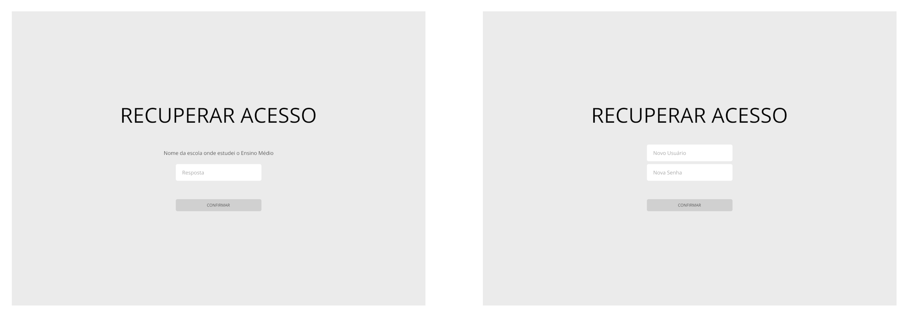
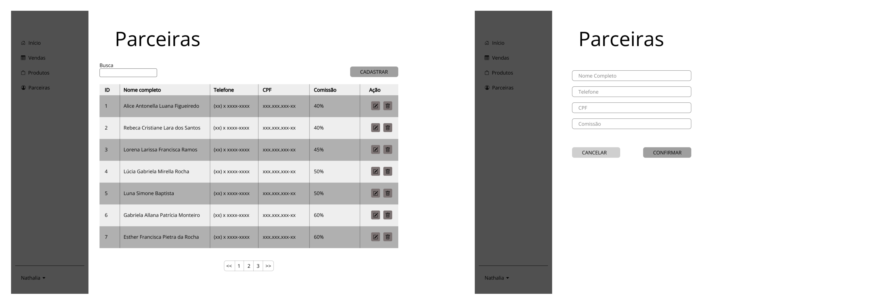
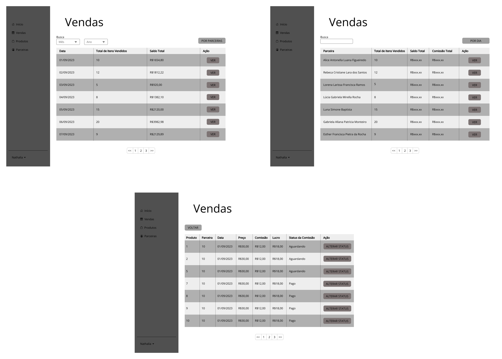

# Projeto de Interface

## Diagrama de Fluxo

O diagrama abaixo apresenta o fluxo de interação do usuário com o aplicativo. As telas deste fluxo serão descritas melhor na [seção de wireframes logo abaixo](#wireframes).

## Wireframes

Conforme fluxo de telas do projeto, apresentado no item anterior, as telas do sistema são apresentadas em detalhes nos itens a seguir. Para visualizar os wireframes interativos, acesse o [ambiente no Figma do projeto](https://www.figma.com/proto/Eav13dEACBIa9oxImQ9Ydw/Interface-Web).

### Tela de Login

### Tela de Registro do Novo Usuário

### Tela de Recuperação de Acesso

### Tela Inicial

### Produtos

### Parceiras

### Histórico de Vendas

