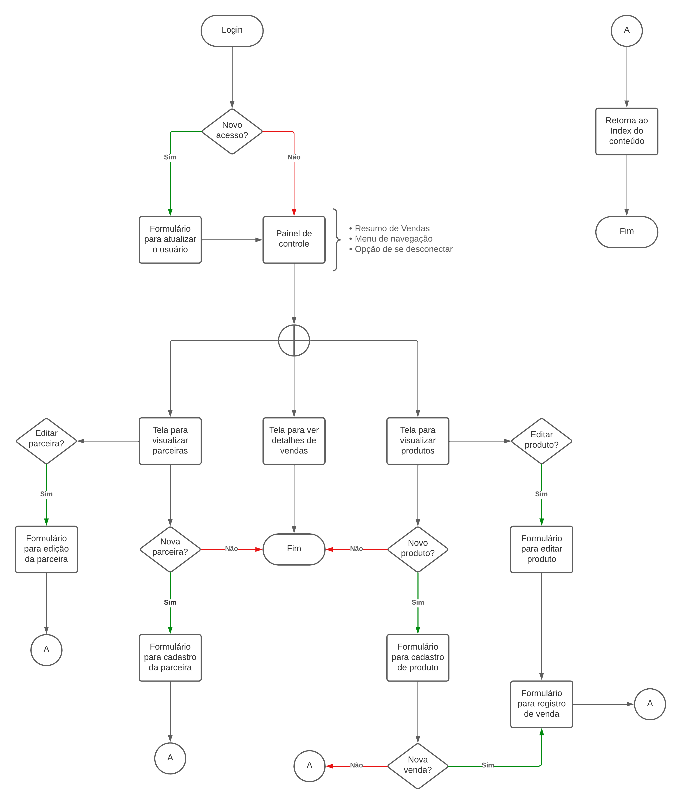

# Projeto de Interface

## Diagrama de Fluxo

O diagrama abaixo apresenta o fluxo de interação do usuário com o aplicativo. As telas deste fluxo serão descritas melhor na [seção de wireframes logo abaixo](#wireframes).

## Wireframes